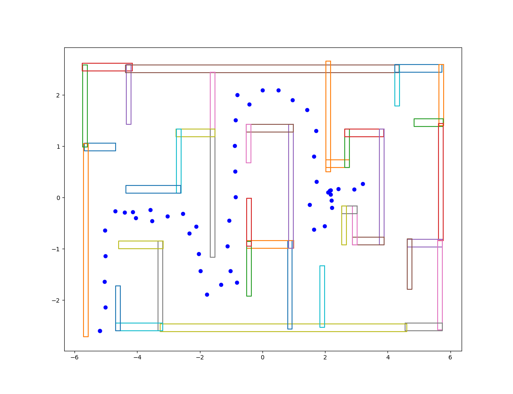

## Autonomous maze solver

This package has 3 main scripts :

1. path_planner: RRT algorithm to compute the final path of the given maze 
2. controller : PID controller to move the bot between two points of the path_planner
3. color_detector: To detect and print the color at the final goal. 

Sample output of the path_planner node 
